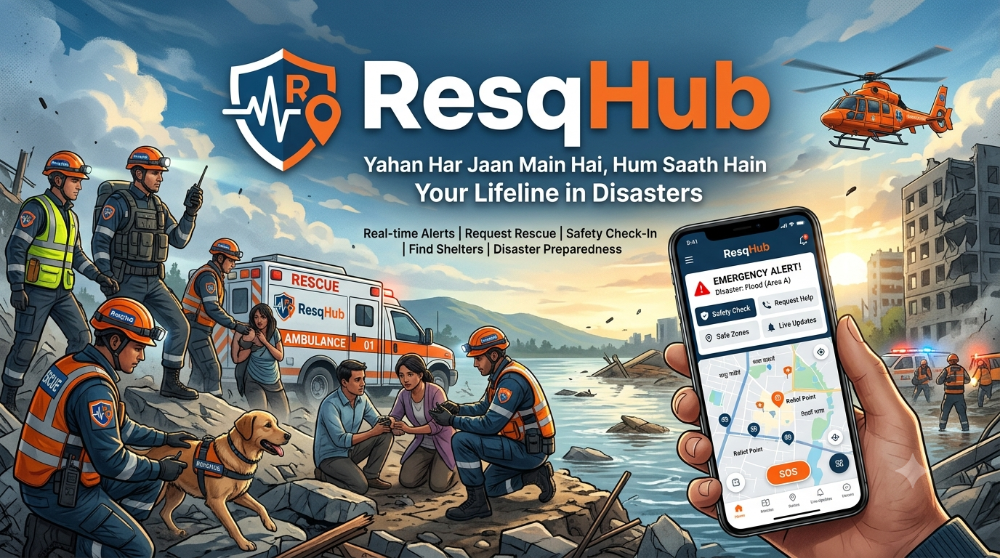

# 🚨 ResQHub: Disaster Relif System

> **Tagline:** A smart, crash_proof emergency management system that works even without the internet.
> **Team Name:** LogicLoop

---

  

<h1 align="center">ResQHub 🚨</h1>

  <strong>Your Lifeline in Every Disaster</strong> 
  <em>Har Jaan Ke Saath, Har Sankat Mein Paas</em>

---

## 📌 Problem Statement

During disaster like floods or earthquakes, communication system fail drastically:
* ✖️ **Network Blackout:** 3G/4G/5G mobile internet and cell towers get destroyed or shut down.
* ✖️ **Control Room Chaos:** Managing thousands of request makes it difficult to differntitate bte  high-risk critical victims and non-urgent request.
* ✖️ **Lack of donor Transparency:** Donors lack trust regarding whether their donated supplies or funds actually reach the victims in time.

---
## 💡 Our Solution (ResQHub)
ResQHub is a resilient, 3-layered disaster relief architecture designed to ensure zero faliure during emergency rescue operations:

* ⚡ **3-layered SOS Resilience:**
 1.  ** Layer 1 (Online Mode):** High -Speed fastApI endpoints when mobile network are active.
 2.   ** layer 2 (@G SMS Fallback):** Automatic background short 2G SMS triggering when internet connectivity drops.
 3.   ** layer 3 (Bluetooth Mesh Networking):** Peer-to-peer (Hop by-Hop) data transfer using Web Bluetooth when mobile towers completely collapse.
* 🏹 **Smart Priority Scoring Algorithm(1 to 10):** Automatically prioritizes critical cases (Medical & Trapped cases) to the top of the queue for the rescue control room.
* 🤝 **Donor Transparency Portal:** Real-time supply Tracking with Gps and photo proof-of-delievery for donors.

---

## 🔌 API Endpoints References
All Endpoints are using **FastAPI** and include automatic request validation via **Pydantic**.
### 1. User / Victim Interface (SOS ingestion)
* **`POST /api/user/sos`** - Submit an emergency SOS when internet is active(layer 1).
* **`post /api/user/sms-webhook`** - Process incomig 2G sms payloads from GSM gateway (layer 2).
* **`POST /api/user/mesh-sync`** Sync relayed SOS data packets received via bluetooth MEsh(layer 3).

### 2. Emergency Control Room Interfacce
* **`GET /api/control-room/queue`** Fetch all emergency request automatically sortedd by Priority Score(10 tp 1)
* **`POST /api/control-room/update-status/{sos_id}`** - Update rescue operations status ('Pending','Dispatch','Resolved').

### 3. Relief & Donor Portal Interface
* **`GET /api/donor/list`** -Retrieve all transparently verified relief donations and camp locations .
* **`POST /api/donor/add`** -Register a new donor
---

## ⚒️ Tech Stack
| Component | Technology Used |
| :--- | :--- |
| **Backend API** | Python (fastAPI + Pydantic) |
| **Frontend UI** | Html/CSS |
| **Database** | In-Memory Data Structure (Scalable to MySQL) |
| **offline Fallback** | 2G SMS Gateway Hook & web Bluetooth API |

---
